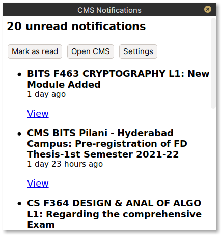

# Moodle CMS Notifications

* View unread Moodle CMS notifications. 
* Mark all notifications as read.
* Lightweight with no dependencies.
* Cross platform.
* Authentication using tokens, so should be secure.
* Works for any Moodle deployment.
* Refreshes every 15 minutes in the background.
* Written in Rust.

**If you have `cargo` installed**, install this application directly using `cargo install cms_notifs` and launch it by running the command `cms_notifs`.

## Using

* Download for Linux ( 64 bit ) from [here](binaries/cms_notifs_linux).
* Make the downloaded file executable ( `chmod +x /path/to/downloaded/file` )
* Run the downloaded executable. ( ` ./path/to/downloaded/file` )
* Fill in the required config details asked.
* It will run in the background.

## Command Line Arguments

* `--settings` - Opens the settings dialog on startup.
* `--silent-errors` - Errors wont show up in a GUI window, but will still be logged.

Launch with `--settings` command line argument to open the settings dialog.

## Compile from source

* Clone this repository.
* Install the [rust toolchain](https://www.rust-lang.org/tools/install).
* ( Linux only ) Install Webkit development library by running `sudo apt install libwebkit2gtk-4.0-dev`
* Run `cargo run` to compile and run the application.

## Todo

* Auto-startup on login.
* More configuration options.
* Better Error handling.
* Refactor code to be more idiomatic.

## License

Copyright (C) 2021  Divyanshu Agrawal

This program is free software: you can redistribute it and/or modify
it under the terms of the GNU General Public License as published by
the Free Software Foundation, either version 3 of the License, or
(at your option) any later version.

This program is distributed in the hope that it will be useful,
but WITHOUT ANY WARRANTY; without even the implied warranty of
MERCHANTABILITY or FITNESS FOR A PARTICULAR PURPOSE.  See the
GNU General Public License for more details.

You should have received a copy of the GNU General Public License
along with this program.  If not, see <https://www.gnu.org/licenses/>.